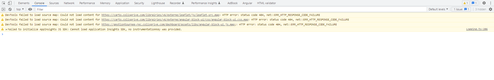
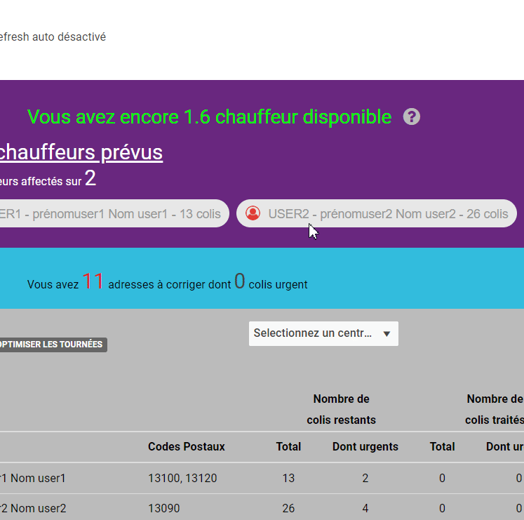

## Console JavaScript
La console JavaScript des navigateurs constitue une interface de développement cruciale, offrant aux développeurs et au support technique un moyen puissant d'interagir avec le moteur JavaScript en temps réel. Accessible via les outils de développement du navigateur, cette console fournit une fenêtre interactive où les utilisateurs peuvent saisir des commandes JavaScript, évaluer des expressions, et recevoir instantanément des résultats. Elle joue un rôle essentiel dans le processus de débogage en affichant des messages d'erreurs, des avertissements, et des informations de débogage, permettant ainsi une identification rapide des problèmes dans le code. De plus, la console sert de canal de communication entre le navigateur et le développeur, facilitant la surveillance des requêtes réseau, le suivi des performances, et la gestion des événements en temps réel. En fournissant une interface interactive et réactive, la console JavaScript s'avère être un outil indispensable pour comprendre, diagnostiquer et optimiser les applications web en cours de développement ou de maintenance.

## Ouvrir la console

Pour ouvrir la console du navigateur Google Chrome, suivez ces étapes simples. Cliquez droit n'importe où sur la page web, sélectionnez "Inspecter" dans le menu contextuel, puis rendez-vous dans l'onglet "Console". Alternativement, vous pouvez utiliser le raccourci clavier en appuyant sur **Ctrl+Shift+J** (Windows/Linux) ou **Cmd+Opt+J** (Mac).

Pour les utilisateurs de Mozilla Firefox, l'accès à la console se fait également de manière intuitive. Cliquez droit sur la page, choisissez "Inspecter l'élément" et dirigez-vous vers l'onglet "Console". Le raccourci clavier est **Ctrl+Shift+K** (Windows/Linux) ou **Cmd+Opt+K** (Mac).

En utilisant ces méthodes simples, vous pourrez rapidement ouvrir la console des navigateurs Chrome et Firefox, facilitant ainsi l'accès à des fonctionnalités de débogage avancées et la récupération d'informations cruciales lors de vos interventions en support technique.

vous pouvez aussi ouvrir la console en éffectuant un clic droit sur la souris > Inspecter
