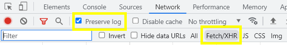
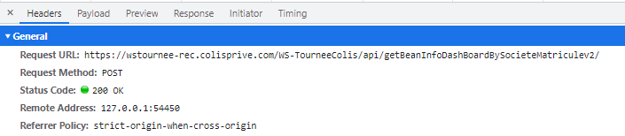

## Réponse des Web Services
Pour récupérer les réponse du Ws Services, ouvrez la console JavaScript de votre navigateur, puis rendez-vous sur l'onglet "Réseau | Network"

Vous pouvez cochez l'option **Preserve log** afin de garder les requêtes envoyées même si vous actualisez la page 
Vous pouvez filtrer les requêtes en choisssisant le filtre **Hetch/XHR** pour voir que les requêtes qui font appelent à des Web Services

le tableau ci-dessous décrit les partie importantes de la figure 06

| Name | Status | Type | Initiator | 
| ----------- | ----------- | ----------- | ----------- |
| Nom de la requête | Statut de la réponse | Son type | Le fichier déclencheur |

Séléctionner la requête que vous souhaitez consulter en choisissant cette dernière dans la partie **Name**

La figure **08** représente la requête, dans le premier onglet on trouve l'entête de la request **Header**
Dans l'onglet **Payload** on aura le corps de la requête **Body** 
Les onglets **Preview** et **Response** on aura la réponse du serveur

## Comment récupérer les bonnes informations 

La première partie de l'en-tête de la requête est la plus importante car elle contient l'URL du Web Service appelé, le statut de la réponse

Pour transmettre les informations au L3 récupérer l'URL du Web Service et le statut de la réponse, ensuite vous devez aussi envoyer les paramètres envoyés dans le corps de la requête. Pour cela rendez-vous sur l'onglet **Payload** et vous trouverez les infos dans cette section s'il y'en a. *Le coprs n'est pas toujours envoyé avec la requête* 

Pour copier le coprs de la requête faite un clic droit dessus puis **Copier l'objet** comme le montre la *Figure 11*

