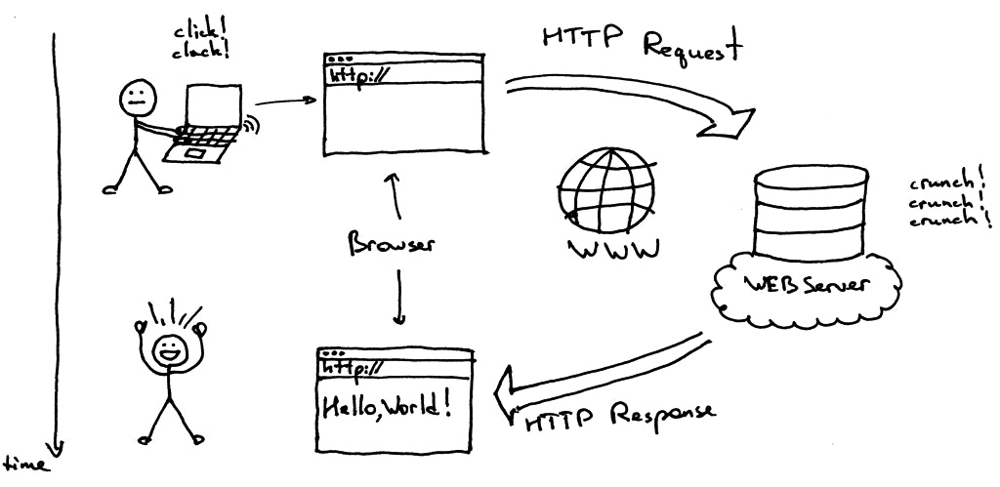

## Courte définition
Les requêtes HTTP, ou HyperText Transfer Protocol requests, sont des messages envoyés par un client (tel qu'un navigateur web) à un serveur web dans le but d'initier une communication et de demander des données. Ce protocole de communication standardisé est utilisé pour le transfert d'informations sur le World Wide Web. Une requête HTTP contient des informations telles que la méthode de la requête **(GET, POST, PUT, DELETE, etc.)**, l'URL cible, les en-têtes (headers) spécifiant des détails sur la requête, et éventuellement un corps de requête contenant des données, comme dans le cas des requêtes POST. Une fois que le serveur reçoit la requête, il répond avec un message de réponse HTTP, contenant des informations sur le statut de la requête, des en-têtes de réponse, et éventuellement un corps de réponse contenant les données demandées. Les requêtes HTTP sont fondamentales pour l'interaction entre les clients et les serveurs sur Internet, permettant le chargement de pages web, l'envoi de données de formulaires, et divers autres échanges d'informations.

## Code de réponse

1. **1xx (Informations) :**

- 100 Continue : Indique que le serveur a reçu la première partie de la requête et attend le reste.
- 101 Switching Protocols : Le serveur accepte le changement de protocole demandé par le client.
2. **2xx (Succès) :**

- 200 OK : La requête a réussi, et la réponse dépend de la méthode utilisée.
- 201 Created : Indique que la requête a été traitée avec succès, résultant en la création d'une nouvelle ressource.
- 204 No Content : La requête a été traitée avec succès, mais il n'y a pas de contenu à renvoyer.
- 206 Partial Content : Indique que la partie de la requête demandée a été reçue avec succès.
3. **3xx (Redirection) :**

- 300 Multiple Choices : Il y a plusieurs options disponibles, le client doit en choisir une.
- 301 Moved Permanently : La ressource demandée a été déplacée de manière permanente vers une nouvelle URL.
- 302 Found : La ressource demandée a été trouvée, mais elle a été temporairement déplacée vers une autre URL.
- 304 Not Modified : Indique que la ressource n'a pas été modifiée depuis la dernière requête.
4. **4xx (Erreur client) :**

- 400 Bad Request : La requête du client est mal formulée.
- 401 Unauthorized : Le client doit s'authentifier pour obtenir la réponse demandée.
- 403 Forbidden : Le serveur comprend la requête, mais refuse de l'autoriser.
- 404 Not Found : La ressource demandée n'a pas été trouvée sur le serveur.
5. **5xx (Erreur serveur) :**

- 500 Internal Server Error : Une condition imprévue a empêché le serveur de remplir la requête.
- 502 Bad Gateway : Le serveur, en agissant comme une passerelle, a reçu une réponse non valide depuis un serveur en amont.
- 503 Service Unavailable : Le serveur n'est pas prêt à gérer la requête. Les causes sont généralement temporaires.
  
Chaque catégorie de codes de réponse HTTP fournit des informations sur le statut de la requête, permettant aux clients et aux développeurs de comprendre et de traiter la réponse du serveur de manière appropriée.